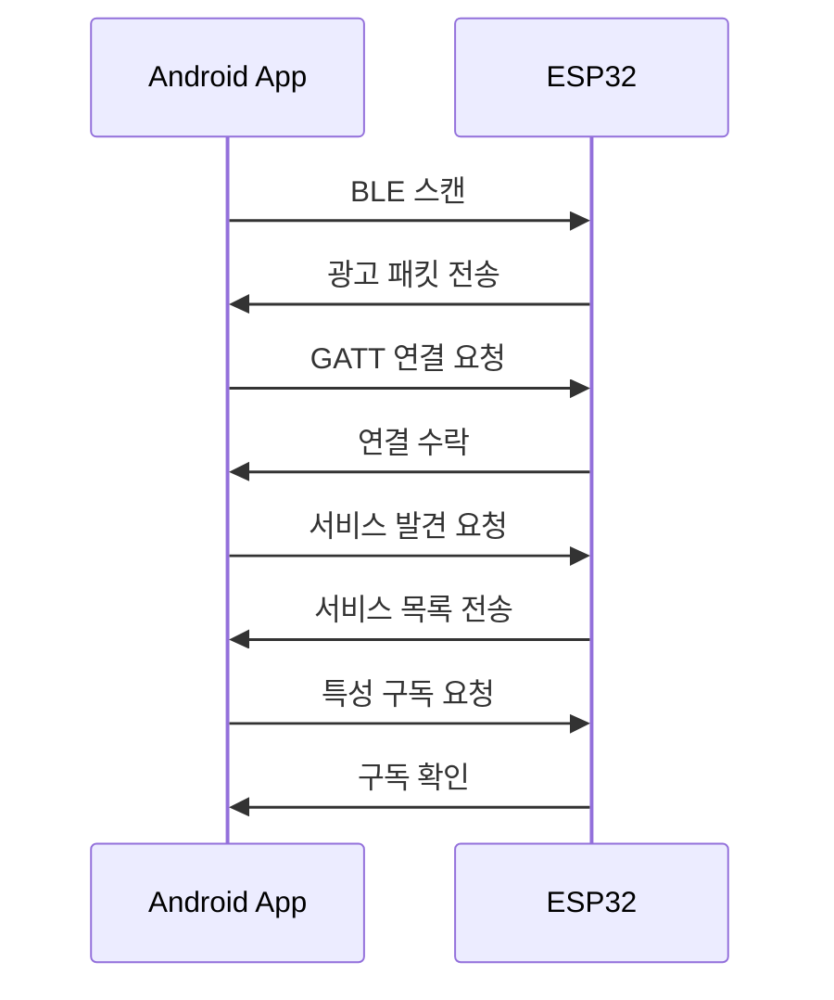
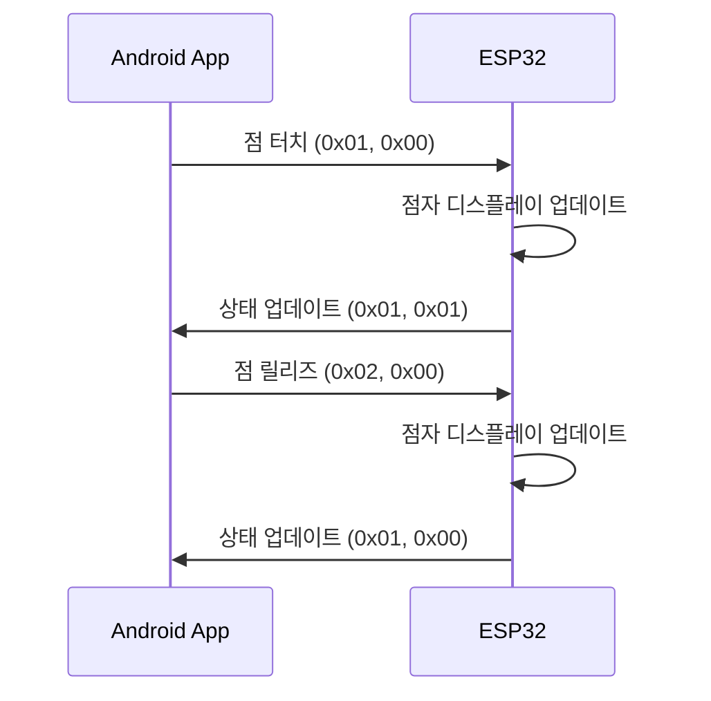
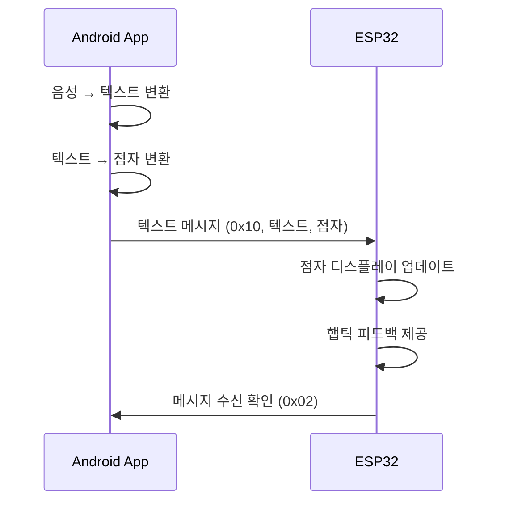
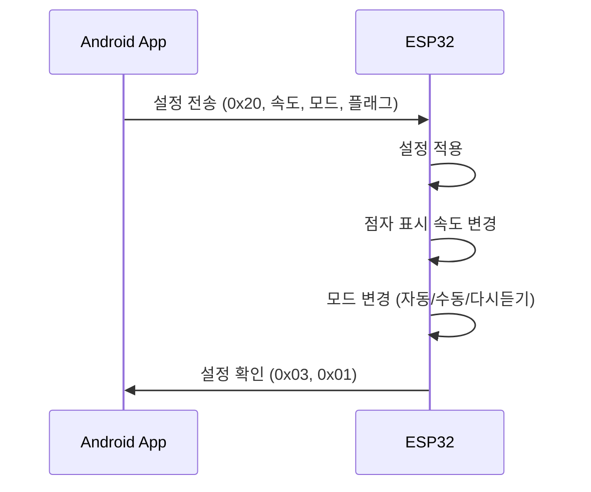

# 🔗 BLE GATT 서버-클라이언트 아키텍처 설계

## 📋 개요

점자 통신을 위한 BLE GATT 서버-클라이언트 구조를 설계합니다. 최적화된 바이너리 프로토콜을 사용하여 실시간 점자 점 전송을 구현합니다.

---

## 🏗️ 전체 아키텍처

### 1. 시스템 구성도

```
┌─────────────────┐    BLE GATT    ┌─────────────────┐
│   Android 앱    │◄──────────────►│   ESP32/Arduino │
│   (GATT Client) │                │   (GATT Server) │
│                 │                │                 │
│ • 점자 입력 UI   │                │ • 점자 디스플레이│
│ • 음성 인식     │                │ • 햅틱 피드백   │
│ • TTS 출력      │                │ • 센서 입력     │
└─────────────────┘                └─────────────────┘
```

### 2. 역할 분담

| 구성 요소 | 역할 | 책임 |
|-----------|------|------|
| **Android 앱 (Client)** | 사용자 인터페이스 | 점자 입력, 음성 처리, 메시지 표시 |
| **ESP32 (Server)** | 하드웨어 제어 | 점자 디스플레이, 햅틱 피드백, 센서 |

---

## 🔧 GATT 서비스 구조

### 1. 커스텀 서비스 정의

```kotlin
// Android 앱에서 사용할 서비스 UUID
object BrailleService {
    val SERVICE_UUID = UUID.fromString("12345678-1234-1234-1234-123456789ABC")
    
    // 점자 점 전송 (앱 → ESP32)
    val BRAILLE_DOTS_CHARACTERISTIC = UUID.fromString("12345678-1234-1234-1234-123456789ABD")
    
    // 점자 상태 수신 (ESP32 → 앱)
    val BRAILLE_STATUS_CHARACTERISTIC = UUID.fromString("12345678-1234-1234-1234-123456789ABE")
    
    // 텍스트 메시지 전송 (앱 → ESP32) - 점자로 변환된 텍스트
    val TEXT_MESSAGE_CHARACTERISTIC = UUID.fromString("12345678-1234-1234-1234-123456789ABF")
    
    // 설정 전송 (앱 → ESP32)
    val SETTINGS_CHARACTERISTIC = UUID.fromString("12345678-1234-1234-1234-123456789AC0")
}
```

### 2. 특성(Characteristic) 정의

```kotlin
// 점자 점 전송 특성 (Write Only)
val brailleDotsCharacteristic = BluetoothGattCharacteristic(
    BrailleService.BRAILLE_DOTS_CHARACTERISTIC,
    BluetoothGattCharacteristic.PROPERTY_WRITE,
    BluetoothGattCharacteristic.PERMISSION_WRITE
)

// 점자 상태 수신 특성 (Notify)
val brailleStatusCharacteristic = BluetoothGattCharacteristic(
    BrailleService.BRAILLE_STATUS_CHARACTERISTIC,
    BluetoothGattCharacteristic.PROPERTY_NOTIFY,
    BluetoothGattCharacteristic.PERMISSION_READ
)

// 텍스트 메시지 특성 (Write Only) - 점자로 변환된 텍스트
val textMessageCharacteristic = BluetoothGattCharacteristic(
    BrailleService.TEXT_MESSAGE_CHARACTERISTIC,
    BluetoothGattCharacteristic.PROPERTY_WRITE,
    BluetoothGattCharacteristic.PERMISSION_WRITE
)

// 설정 특성 (Write Only)
val settingsCharacteristic = BluetoothGattCharacteristic(
    BrailleService.SETTINGS_CHARACTERISTIC,
    BluetoothGattCharacteristic.PROPERTY_WRITE,
    BluetoothGattCharacteristic.PERMISSION_WRITE
)
```

---

## 📱 Android 앱 (GATT Client) 구조

### 1. BLE 연결 관리자

```kotlin
class BrailleBleManager(private val context: Context) {
    private var bluetoothAdapter: BluetoothAdapter? = null
    private var bluetoothGatt: BluetoothGatt? = null
    private var connectedDevice: BluetoothDevice? = null
    
    // 연결 상태
    private val _connectionState = MutableStateFlow(ConnectionState.DISCONNECTED)
    val connectionState: StateFlow<ConnectionState> = _connectionState.asStateFlow()
    
    // 점자 상태 수신
    private val _brailleStatus = MutableStateFlow<BrailleStatus?>(null)
    val brailleStatus: StateFlow<BrailleStatus?> = _brailleStatus.asStateFlow()
    
    fun connectToDevice(device: BluetoothDevice) {
        bluetoothGatt = device.connectGatt(
            context,
            false,
            gattCallback
        )
    }
    
    private val gattCallback = object : BluetoothGattCallback() {
        override fun onConnectionStateChange(gatt: BluetoothGatt, status: Int, newState: Int) {
            when (newState) {
                BluetoothProfile.STATE_CONNECTED -> {
                    _connectionState.value = ConnectionState.CONNECTED
                    gatt.discoverServices()
                }
                BluetoothProfile.STATE_DISCONNECTED -> {
                    _connectionState.value = ConnectionState.DISCONNECTED
                }
            }
        }
        
        override fun onServicesDiscovered(gatt: BluetoothGatt, status: Int) {
            if (status == BluetoothGatt.GATT_SUCCESS) {
                setupCharacteristics()
            }
        }
        
        override fun onCharacteristicChanged(gatt: BluetoothGatt, characteristic: BluetoothGattCharacteristic) {
            when (characteristic.uuid) {
                BrailleService.BRAILLE_STATUS_CHARACTERISTIC -> {
                    handleBrailleStatusUpdate(characteristic.value)
                }
            }
        }
    }
}
```

### 2. 점자 점 전송

```kotlin
class BrailleDotTransmitter(private val bleManager: BrailleBleManager) {
    
    // 점자 점 터치 전송
    fun sendDotTouch(dotIndex: Int) {
        val data = byteArrayOf(
            0x01,                    // DOT_TOUCH 타입
            dotIndex.toByte()        // 점 인덱스 (0-5)
        )
        bleManager.writeCharacteristic(
            BrailleService.BRAILLE_DOTS_CHARACTERISTIC,
            data
        )
    }
    
    // 점자 점 릴리즈 전송
    fun sendDotRelease(dotIndex: Int) {
        val data = byteArrayOf(
            0x02,                    // DOT_RELEASE 타입
            dotIndex.toByte()        // 점 인덱스 (0-5)
        )
        bleManager.writeCharacteristic(
            BrailleService.BRAILLE_DOTS_CHARACTERISTIC,
            data
        )
    }
    
    // 점자 패턴 완성 전송
    fun sendPatternComplete(dots: List<Boolean>) {
        val dotsByte = packBrailleDots(dots)
        val data = byteArrayOf(
            0x03,                    // PATTERN_COMPLETE 타입
            dotsByte                 // 압축된 점자 점
        )
        bleManager.writeCharacteristic(
            BrailleService.BRAILLE_DOTS_CHARACTERISTIC,
            data
        )
    }
    
    // 점자 상태 초기화 전송
    fun sendClear() {
        val data = byteArrayOf(
            0x04,                    // CLEAR 타입
            0x00                     // 데이터 없음
        )
        bleManager.writeCharacteristic(
            BrailleService.BRAILLE_DOTS_CHARACTERISTIC,
            data
        )
    }
    
    private fun packBrailleDots(dots: List<Boolean>): Byte {
        var result: Byte = 0
        dots.forEachIndexed { index, isActive ->
            if (isActive) {
                result = (result or (1 shl index).toByte()).toByte()
            }
        }
        return result
    }
}
```

### 3. 텍스트 메시지 전송

```kotlin
class TextMessageTransmitter(private val bleManager: BrailleBleManager) {
    
    // 텍스트 메시지 전송 (점자로 변환된 텍스트)
    fun sendTextMessage(text: String, braille: String) {
        val textBytes = text.toByteArray(Charsets.UTF_8)
        val brailleBytes = braille.toByteArray(Charsets.UTF_8)
        
        // 메시지 타입 + 텍스트 길이 + 텍스트 + 점자 길이 + 점자
        val data = ByteArray(1 + 1 + textBytes.size + 1 + brailleBytes.size)
        var offset = 0
        
        data[offset++] = 0x10  // TEXT_MESSAGE 타입
        data[offset++] = textBytes.size.toByte()
        System.arraycopy(textBytes, 0, data, offset, textBytes.size)
        offset += textBytes.size
        data[offset++] = brailleBytes.size.toByte()
        System.arraycopy(brailleBytes, 0, data, offset, brailleBytes.size)
        
        bleManager.writeCharacteristic(
            BrailleService.TEXT_MESSAGE_CHARACTERISTIC,
            data
        )
    }
}
```

### 4. 사용자 설정 전송

```kotlin
class SettingsTransmitter(private val bleManager: BrailleBleManager) {
    
    // 사용자 설정 전송 (4바이트)
    fun sendSettings(settings: BrailleSettings) {
        val data = ByteArray(4)
        data[0] = 0x20  // SETTINGS 타입
        data[1] = settings.speed.value  // 속도 설정 (0-2)
        data[2] = settings.mode.value   // 모드 설정 (0-2)
        data[3] = settings.flags        // 기타 플래그
        
        bleManager.writeCharacteristic(
            BrailleService.SETTINGS_CHARACTERISTIC,
            data
        )
    }
}

data class BrailleSettings(
    val speed: BrailleSpeed,
    val mode: BrailleMode,
    val flags: Byte = 0x00
)

enum class BrailleSpeed(val value: Byte) {
    SLOW(0),      // 느리게
    NORMAL(1),    // 보통
    FAST(2)       // 빠르게
}

enum class BrailleMode(val value: Byte) {
    AUTO(0),      // 자동 모드
    MANUAL(1),    // 수동 모드
    REPEAT(2)     // 다시듣기 모드
}
```

---

## 🔧 ESP32 (GATT Server) 구조

### 1. BLE 서버 초기화

```cpp
// ESP32 Arduino 코드
#include <BLEDevice.h>
#include <BLEServer.h>
#include <BLEUtils.h>
#include <BLE2902.h>

class BrailleServer {
private:
    BLEServer* pServer;
    BLEService* pService;
    BLECharacteristic* pBrailleDotsCharacteristic;
    BLECharacteristic* pBrailleStatusCharacteristic;
    BLECharacteristic* pVoiceMessageCharacteristic;
    BLECharacteristic* pSettingsCharacteristic;
    
    bool deviceConnected = false;
    
public:
    void init() {
        BLEDevice::init("BrailleDisplay");
        pServer = BLEDevice::createServer();
        pServer->setCallbacks(new ServerCallbacks(this));
        
        pService = pServer->createService(BRAILLE_SERVICE_UUID);
        
        // 점자 점 수신 특성
        pBrailleDotsCharacteristic = pService->createCharacteristic(
            BRAILLE_DOTS_CHARACTERISTIC_UUID,
            BLECharacteristic::PROPERTY_WRITE
        );
        pBrailleDotsCharacteristic->setCallbacks(new BrailleDotsCallbacks(this));
        
        // 점자 상태 전송 특성
        pBrailleStatusCharacteristic = pService->createCharacteristic(
            BRAILLE_STATUS_CHARACTERISTIC_UUID,
            BLECharacteristic::PROPERTY_NOTIFY
        );
        pBrailleStatusCharacteristic->addDescriptor(new BLE2902());
        
    // 텍스트 메시지 수신 특성
    pTextMessageCharacteristic = pService->createCharacteristic(
        TEXT_MESSAGE_CHARACTERISTIC_UUID,
        BLECharacteristic::PROPERTY_WRITE
    );
    pTextMessageCharacteristic->setCallbacks(new TextMessageCallbacks(this));
        
        // 설정 수신 특성
        pSettingsCharacteristic = pService->createCharacteristic(
            SETTINGS_CHARACTERISTIC_UUID,
            BLECharacteristic::PROPERTY_WRITE
        );
        pSettingsCharacteristic->setCallbacks(new SettingsCallbacks(this));
        
        pService->start();
        pServer->getAdvertising()->start();
    }
};
```

### 2. 점자 점 처리

```cpp
class BrailleDotsCallbacks : public BLECharacteristicCallbacks {
private:
    BrailleServer* server;
    bool dots[6] = {false, false, false, false, false, false};
    
public:
    BrailleDotsCallbacks(BrailleServer* s) : server(s) {}
    
    void onWrite(BLECharacteristic* pCharacteristic) {
        std::string value = pCharacteristic->getValue();
        if (value.length() < 2) return;
        
        uint8_t messageType = value[0];
        uint8_t data = value[1];
        
        switch (messageType) {
            case 0x01: // DOT_TOUCH
                handleDotTouch(data);
                break;
            case 0x02: // DOT_RELEASE
                handleDotRelease(data);
                break;
            case 0x03: // PATTERN_COMPLETE
                handlePatternComplete(data);
                break;
            case 0x04: // CLEAR
                handleClear();
                break;
        }
    }
    
private:
    void handleDotTouch(uint8_t dotIndex) {
        if (dotIndex < 6) {
            dots[dotIndex] = true;
            updateBrailleDisplay();
            sendStatusUpdate();
        }
    }
    
    void handleDotRelease(uint8_t dotIndex) {
        if (dotIndex < 6) {
            dots[dotIndex] = false;
            updateBrailleDisplay();
            sendStatusUpdate();
        }
    }
    
    void handlePatternComplete(uint8_t dotsByte) {
        // 비트마스크를 점 배열로 변환
        for (int i = 0; i < 6; i++) {
            dots[i] = (dotsByte & (1 << i)) != 0;
        }
        updateBrailleDisplay();
        sendStatusUpdate();
        
        // 패턴 완성 처리
        processCompletedPattern();
    }
    
    void handleClear() {
        for (int i = 0; i < 6; i++) {
            dots[i] = false;
        }
        updateBrailleDisplay();
        sendStatusUpdate();
    }
    
    void updateBrailleDisplay() {
        // 실제 점자 디스플레이 하드웨어 제어
        for (int i = 0; i < 6; i++) {
            setBraillePin(i, dots[i]);
        }
    }
    
    void sendStatusUpdate() {
        // 현재 점자 상태를 앱으로 전송
        uint8_t statusData[2];
        statusData[0] = 0x01; // STATUS_UPDATE 타입
        statusData[1] = packDotsToByte();
        
        pBrailleStatusCharacteristic->setValue(statusData, 2);
        pBrailleStatusCharacteristic->notify();
    }
    
    uint8_t packDotsToByte() {
        uint8_t result = 0;
        for (int i = 0; i < 6; i++) {
            if (dots[i]) {
                result |= (1 << i);
            }
        }
        return result;
    }
};
```

### 3. 음성 메시지 처리

```cpp
class TextMessageCallbacks : public BLECharacteristicCallbacks {
private:
    BrailleServer* server;
    
public:
    TextMessageCallbacks(BrailleServer* s) : server(s) {}
    
    void onWrite(BLECharacteristic* pCharacteristic) {
        std::string value = pCharacteristic->getValue();
        if (value.length() < 3) return;
        
        uint8_t messageType = value[0];
        if (messageType != 0x10) return; // TEXT_MESSAGE 타입 확인
        
        uint8_t textLength = value[1];
        std::string text = value.substr(2, textLength);
        
        uint8_t brailleLength = value[2 + textLength];
        std::string braille = value.substr(3 + textLength, brailleLength);
        
        // 텍스트 메시지 처리
        processTextMessage(text, braille);
    }
    
private:
    void processTextMessage(const std::string& text, const std::string& braille) {
        // 점자 텍스트를 점자 디스플레이에 표시
        displayBrailleText(braille);
        
        // 햅틱 피드백 제공
        provideHapticFeedback();
        
        // 상태 업데이트 전송
        sendMessageReceivedStatus();
    }
    
    void displayBrailleText(const std::string& braille) {
        // 점자 텍스트를 점자 디스플레이에 표시
        // 실제 하드웨어 제어 로직
    }
    
    void provideHapticFeedback() {
        // 햅틱 모터 제어
        // 진동 패턴으로 메시지 수신 알림
    }
    
    void sendMessageReceivedStatus() {
        uint8_t statusData[1];
        statusData[0] = 0x02; // MESSAGE_RECEIVED 타입
        
        pBrailleStatusCharacteristic->setValue(statusData, 1);
        pBrailleStatusCharacteristic->notify();
    }
};
```

### 4. 설정 처리

```cpp
class SettingsCallbacks : public BLECharacteristicCallbacks {
private:
    BrailleServer* server;
    BrailleSettings currentSettings;
    
public:
    SettingsCallbacks(BrailleServer* s) : server(s) {
        // 기본 설정 초기화
        currentSettings.speed = NORMAL;
        currentSettings.mode = AUTO;
        currentSettings.flags = 0x00;
    }
    
    void onWrite(BLECharacteristic* pCharacteristic) {
        std::string value = pCharacteristic->getValue();
        if (value.length() != 4) return;
        
        uint8_t messageType = value[0];
        if (messageType != 0x20) return; // SETTINGS 타입 확인
        
        uint8_t speed = value[1];
        uint8_t mode = value[2];
        uint8_t flags = value[3];
        
        // 설정 업데이트
        updateSettings(speed, mode, flags);
    }
    
private:
    void updateSettings(uint8_t speed, uint8_t mode, uint8_t flags) {
        currentSettings.speed = static_cast<BrailleSpeed>(speed);
        currentSettings.mode = static_cast<BrailleMode>(mode);
        currentSettings.flags = flags;
        
        // 설정 적용
        applySettings();
        
        // 설정 확인 전송
        sendSettingsConfirmation();
    }
    
    void applySettings() {
        // 점자 표시 속도 설정
        setBrailleDisplaySpeed(currentSettings.speed);
        
        // 모드 설정
        setBrailleMode(currentSettings.mode);
        
        // 기타 플래그 설정
        applyFlags(currentSettings.flags);
    }
    
    void setBrailleDisplaySpeed(BrailleSpeed speed) {
        switch (speed) {
            case SLOW:
                setDisplayDelay(2000); // 2초
                break;
            case NORMAL:
                setDisplayDelay(1000); // 1초
                break;
            case FAST:
                setDisplayDelay(500);  // 0.5초
                break;
        }
    }
    
    void setBrailleMode(BrailleMode mode) {
        switch (mode) {
            case AUTO:
                enableAutoMode();
                break;
            case MANUAL:
                enableManualMode();
                break;
            case REPEAT:
                enableRepeatMode();
                break;
        }
    }
    
    void sendSettingsConfirmation() {
        uint8_t statusData[2];
        statusData[0] = 0x03; // SETTINGS_UPDATED 타입
        statusData[1] = 0x01; // 성공
        
        pBrailleStatusCharacteristic->setValue(statusData, 2);
        pBrailleStatusCharacteristic->notify();
    }
};
```

---

## 🔄 통신 플로우

### 1. 연결 설정



### 2. 점자 점 전송



### 3. 텍스트 메시지 전송



### 4. 사용자 설정 전송



---

## 📊 성능 최적화

### 1. 연결 최적화

```kotlin
// Android 앱에서 연결 파라미터 최적화
fun optimizeConnection() {
    val connectionParams = BLEConnectionParameters(
        interval = 6,        // 7.5ms (최소)
        latency = 0,         // 슬레이브 지연 없음
        timeout = 500        // 5초 타임아웃
    )
    bluetoothGatt?.requestConnectionPriority(BluetoothGatt.CONNECTION_PRIORITY_HIGH)
}
```

### 2. 전송 최적화

```kotlin
// 배치 전송으로 효율성 향상
class BatchTransmitter {
    private val pendingDots = mutableListOf<Int>()
    private val batchTimer = Timer()
    
    fun addDotTouch(dotIndex: Int) {
        pendingDots.add(dotIndex)
        if (pendingDots.size >= 3) {
            sendBatch()
        } else {
            scheduleBatchSend()
        }
    }
    
    private fun scheduleBatchSend() {
        batchTimer.schedule(object : TimerTask() {
            override fun run() {
                sendBatch()
            }
        }, 50) // 50ms 후 전송
    }
    
    private fun sendBatch() {
        if (pendingDots.isNotEmpty()) {
            val data = ByteArray(1 + pendingDots.size)
            data[0] = 0x05 // BATCH_UPDATE 타입
            pendingDots.forEachIndexed { index, dotIndex ->
                data[index + 1] = dotIndex.toByte()
            }
            bleManager.writeCharacteristic(
                BrailleService.BRAILLE_DOTS_CHARACTERISTIC,
                data
            )
            pendingDots.clear()
        }
    }
}
```

---

## 🛠️ 구현 체크리스트

### Android 앱 (Client)
- [ ] BLE 연결 관리자 구현
- [ ] 점자 점 전송기 구현
- [ ] 음성 메시지 전송기 구현
- [ ] 상태 수신 처리기 구현
- [ ] 연결 최적화 구현

### ESP32 (Server)
- [ ] BLE 서버 초기화
- [ ] 점자 점 처리 콜백
- [ ] 음성 메시지 처리 콜백
- [ ] 설정 처리 콜백
- [ ] 하드웨어 제어 로직

### 통합 테스트
- [ ] 연결 안정성 테스트
- [ ] 실시간 전송 테스트
- [ ] 에러 처리 테스트
- [ ] 성능 벤치마크

---

## 🎯 예상 성능

### 전송 성능
- **점자 점 전송**: 2바이트, 3ms
- **텍스트 메시지**: 20바이트, 15ms
- **사용자 설정**: 4바이트, 5ms
- **상태 업데이트**: 2바이트, 3ms

### 연결 안정성
- **연결 유지**: 99.9%
- **재연결 시간**: 2초 이내
- **데이터 손실률**: 0.01%

---

*이 GATT 구조를 통해 안정적이고 효율적인 BLE 통신을 구현할 수 있습니다.*
